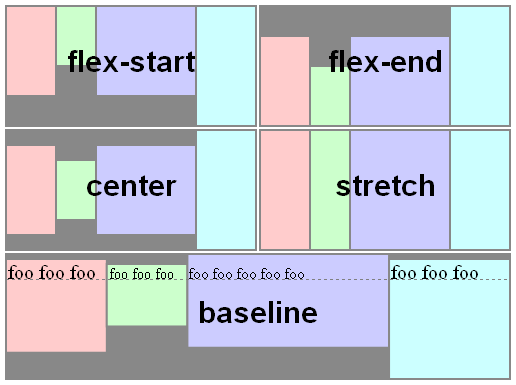
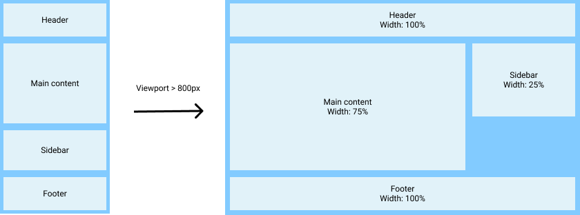

# Exercise 3 – Layout using flexbox and floats

## Flexbox Layout
The main idea behind the flex layout is to give the container the ability to alter its items' width/height (and order) to best fill the available space (mostly to accommodate to all kind of display devices and screen sizes). A flex container expands items to fill available free space, or shrinks them to prevent overflow.

The flex container can have 6 different properties:

#### flex-direction
Flex-direction decides which direction the children elements are flexing. `row` makes the elements flex horizontally `row-reverse` reverses the order of the items in horizontal view, `column` makes the elements spread out vertically, and `column-reverse` will do the same just backwards.

Default flex-direction is set to "row", so if you want a collection of items to spread out vertically you type it like this:
```css
 .main-content {
  display: flex;
  flex-direction: column;
 }
```
#### flex-wrap
The default value for `flex-wrap` is set to nowrap, this is so that items can behave as described above, like an accordion. Setting the value to wrap will make the HTML-elements "jump" to the next line if the parent container shrinks and there is not enough room for the children elements.

#### flex-flow
`flex-flow` is a shorthand property for setting both `flex-wrap` and `flex-direction`.
```css
 .main-content {
   display: flex;
   flex-flow: row wrap;
 }
 /* is the same as */ 
 .main-content {
   display: flex;
   flex-direction: row;
   flex-wrap: wrap;
 }
```
#### justify-content


Using `justify-content` can control the justification inside the container of flexing items, and also white-space between flexing items and their parent container. The different values are: `center`, `flex-start`(default), `flex-end`, `space-around`, `space-between`.

```css 
 .main-content {
  display: flex;
  justify-content: flex-end; 
  /* this will push all children elements to the right side of the parent container if there is available space */
 }
```

```css 
 .main-content {
  display: flex;
  flex-direction: reverse-row;
  justify-content: center; 
  /* this will make all child elements flex in reverse order and be centered in the parent container */
 }
```

#### align-items


`align-items` property sets the align-self value on all direct children as a group. It sets the default alignment of the flex items along the cross axis of each flex line. If `flex-direction` is row and `align-items` is set to flex-start, the items will attach to the top of the container, if `flex-direction` is set to column however, `flex-start` will be pushed to the right in the container, think of `flex-drirection: column` as where you just flip the whole container forward 90degrees.


#### align-content


`align-content` aligns the flex-lines within the flex container when there is extra space in the cross-axis. This rule is only applied when you have a flex container with multiple lines of flexing items.


## :star: Floats
:pencil2: [Open the starting point for this assignment on codepen](https://codepen.io/taranger/pen/JzvqEy)
Solution can be found here [Float layout exercise solution](https://codepen.io/taranger/pen/WmJBRV)

:book: Up until very recently, the main way of creating grid layouts (content separated into rows and columns) was done using floats. Today we have better ways of creating grids, but a lot of websites and applications (unfortunately) still rely on floats. This is usually in order to support legacy browsers, or because rewriting existing codebase is to expensive and/or time consuming. We will therefore spend a little time exploring some of the quirks of using floats for layout.

:exclamation: The following image illustrates the wanted layout for this assignment.



:book: If we compare the image with the starting point on Codepen we see that there are a few things that are off.
1. The height of the parent container is much smaller than its content
2. The child containers are misaligned and overflow the parent container
3. The main content and sidebar do not align on a row

:book: The reasons for this is the following:
1. When we float elements they are taken out of content flow. This essentially means that to the parent container they do not exists and their height is therefore 0. This is probably the biggest drawback of using floats for layout purposes [More on information on content flow for the curious](https://developer.mozilla.org/en-US/docs/Web/CSS/CSS_Flow_Layout/In_Flow_and_Out_of_Flow).
2. This is related to the CSS box model. There are two ways in which width and height of elements can be specified in CSS. Either an element's width and height is only calculated based on its content, or its a combination of content + padding + borders. [Reference on box model](https://developer.mozilla.org/en-US/docs/Web/CSS/CSS_Box_Model/Introduction_to_the_CSS_box_model).
3. This point is also related to the CSS box model. At this point the width of the main content (75%) and the sidebar (25%) is 100%. But because of how the box-sizing property is set (per default), this is in fact wider than the width of the element's container.

:pencil2: In order to fix problem 1 we need to create a new [block formating context(BFC)](https://developer.mozilla.org/en-US/docs/Web/Guide/CSS/Block_formatting_context) for our container. Try googling "CSS clearfix" in order to find to find a solution and implement it in CodePen.

:pencil2: In order to fix problems 2 and 3 we need to adjust the `box-sizing` property of our elements ([reference](https://developer.mozilla.org/en-US/docs/Web/CSS/box-sizing)). Adjust box-sizing for elements in order to create the layout illustrated in the image above.

## :pencil2: Flexbox Tasks
Remember to ask if you are stuck, also [MDN](https://developer.mozilla.org/en-US/docs/Web/CSS) is a good resource.
In this exercise use the example code in this code pen: [Flexbox Tasks](https://codepen.io/marenpg/pen/VwZorjM)
Solution to the Flexbox Tasks can be found here: [Flexbox Tasks solution](https://codepen.io/marenpg/pen/mdbNqOL)

Open the flexbox tasks code pen and start by dragging the window divider in the middle of the screen to try and squeeze the boxes on the right. Or you can drag the whole browser window and see what happens. Since the container does not have the flex dispaly property, and the children elements have the inline-block display property, they will wrap to the next line when whe available space is gone.

#### Task 1
We want to make this container and its elements flex, so lets start by giving the html element with the class ".flex-container" a display property of "flex". Squeeze the browser window as you just did, but observe how the children behave.

#### Task 2
Flex-direction is now set to row, as it is default. Change the flex-direction on the flex-container to column but in a reverse order.

#### Task 3
Make it so that the flexing items are centered inside the flex container using the align-items property.

#### Task 4
Use justify-content property and find a value that makes it so that all the flex children have space between eachother.


### [Go to exercise 4 :arrow_right:](../exercise-4/readme.md)